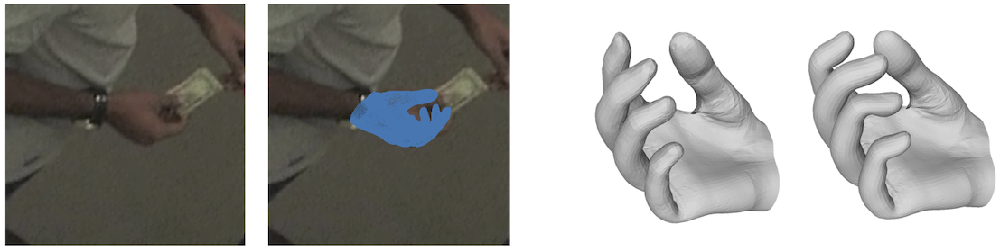
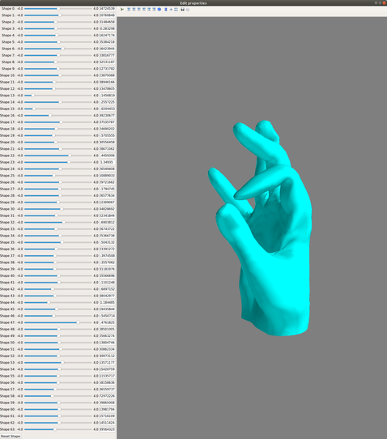

# hand-reconstruction
The official project repository for the **BMVC 2019** paper  
[Single Image 3D Hand Reconstruction with Mesh Convolutions](https://arxiv.org/abs/1905.01326)  
by Dominik Kulon, Haoyang Wang, Riza Alp Güler, Michael Bronstein, Stefanos Zafeiriou

## Introduction

Monocular 3D reconstruction of deformable objects, such as human body parts, has been typically approached by predicting parameters of heavyweight linear models. In this paper, we demonstrate an alternative solution that is based on the idea of encoding images into a latent non-linear representation of meshes. The prior on 3D hand shapes is learned by training an autoencoder with intrinsic graph convolutions performed in the spectral domain. The pre-trained decoder acts as a non-linear statistical deformable model. The latent parameters that reconstruct the shape and articulated pose of hands in the image are predicted using an image encoder.

## Data

~The data can be downloaded from the link below:  
[Hand Reconstruction Data](https://imperiallondon-my.sharepoint.com/:f:/g/personal/dk2317_ic_ac_uk/Ejn5XIVkPuJGlrkaiHwOJvYBTY_hSwUbiHFEzsSPxQdD9w?e=8DaHV2)~

To access the data, please, contact me using the email address provided in the paper.

The *data* directory should be placed in the root of the project structure.

- **./data/datasets/hand-panoptic** - Training data for the image-to-mesh system.
- **./data/datasets/mesh-samples** - Data for pretraining the mesh autoencoder.

- **./data/models/i2m** - The image-to-mesh network.
- **./data/models/spectral-ae** - Spectral autoencoder.

- **./data/template** - Hand template and mesh convolutions operators.

## Requirements

Python 3.6.7  
Tensorflow 1.14.0  
NumPy  
SciPy  

Visualization:  
Matplotlib  
OpenCV  
  
Optional:    
For generating convolution and sampling operators: [COMA](https://github.com/anuragranj/coma)  
For visualizing the latent space as shown in the screenshot below: traits, mayavi  

## Running the code

Testing:
- **./evaluation/spectral_ae.ipynb** - Example of running the trained spectral autoencoder and visualizing the output.
- **./evaluation/i2m.ipynb** - Example of running the trained image-to-mesh system and visualizing the output.

Training:
- **./training/spectral/method/train_spectral_ae.py** - Code for training the spectral autoencoder.
- **./training/i2m/method/train_i2m_spectral_densenet.py** - Code for training the image to mesh system.

## License

If you use the code, please, make sure you are familiar with the [LICENSE](./LICENSE) and cite our paper.

[Single Image 3D Hand Reconstruction with Mesh Convolutions](https://arxiv.org/abs/1905.01326)  

> @inproceedings{dkulon2019rec,  
>   author    = {Dominik Kulon and  
>                Haoyang Wang and  
>                Riza Alp G{\\"{u}}ler and  
>                Michael M. Bronstein and  
>                Stefanos Zafeiriou},  
>   title     = {Single Image 3D Hand Reconstruction with Mesh Convolutions},  
>   booktitle = {Proceedings of the British Machine Vision Conference ({BMVC})},  
>   year      = {2019}  
> }

The training images come from the [CMU Panoptic Dataset](http://domedb.perception.cs.cmu.edu/), training meshes are derivatives of [MANO](http://mano.is.tue.mpg.de/), and the mesh autoencoder architecture is based on [COMA](http://coma.is.tue.mpg.de/).
